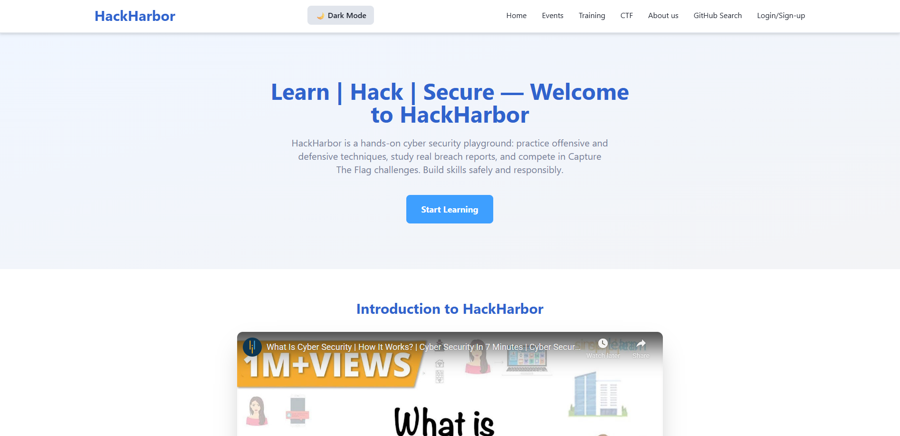
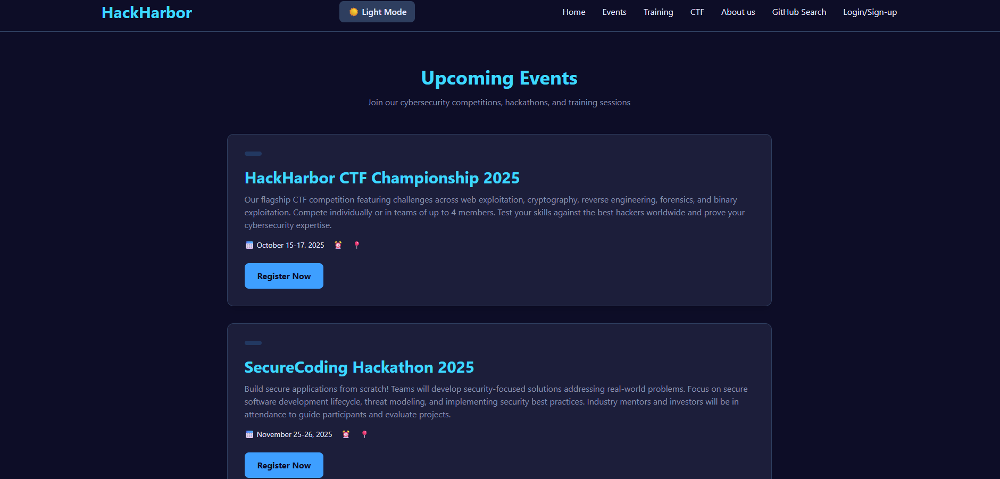
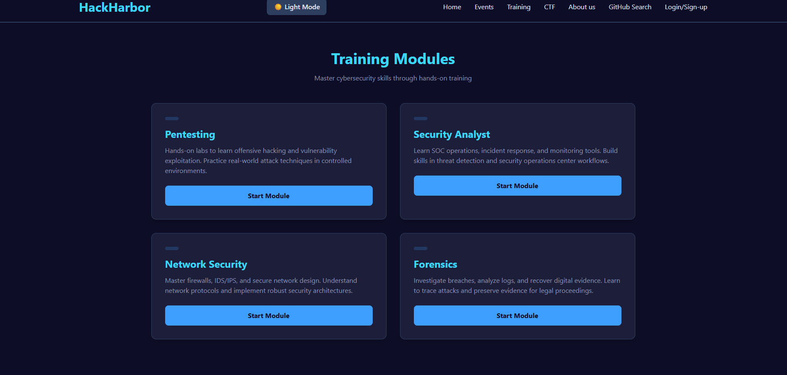
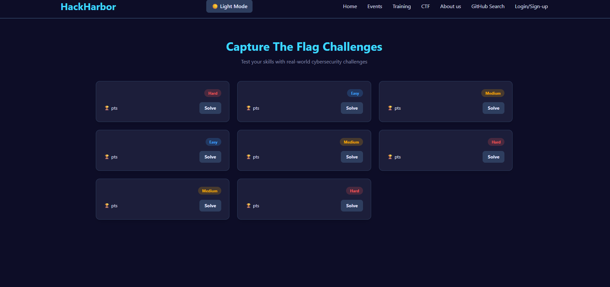
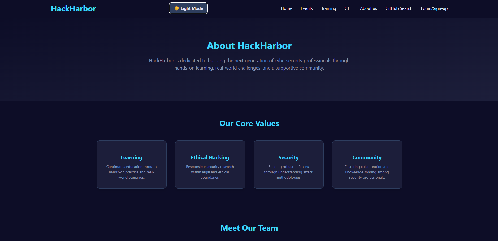
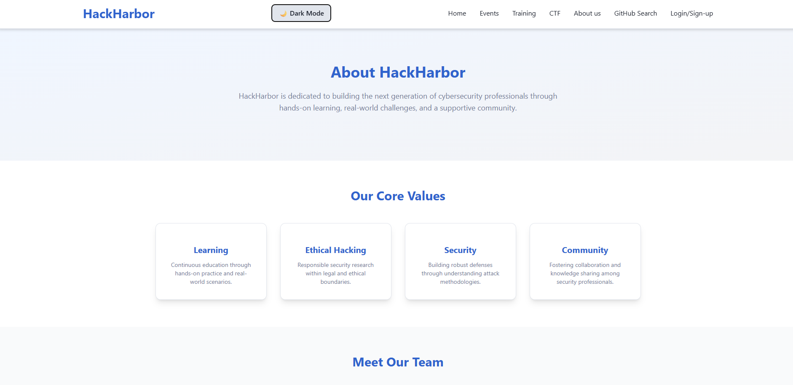
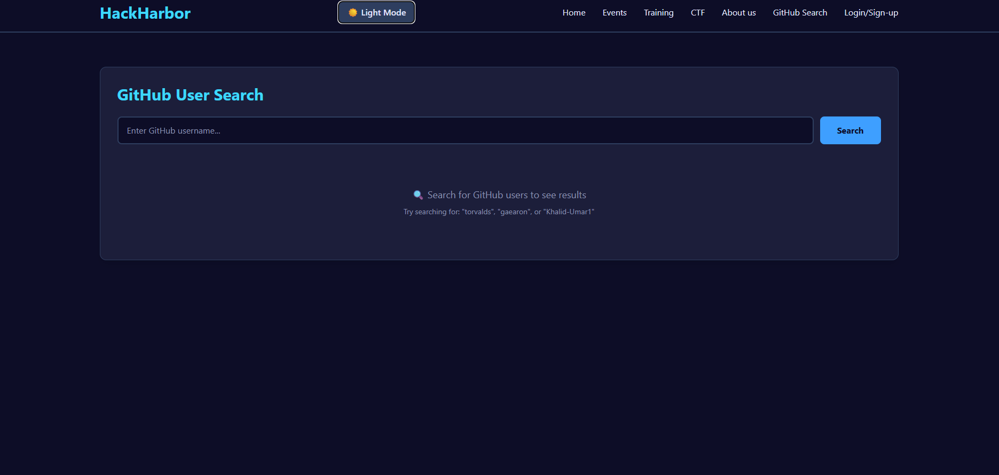
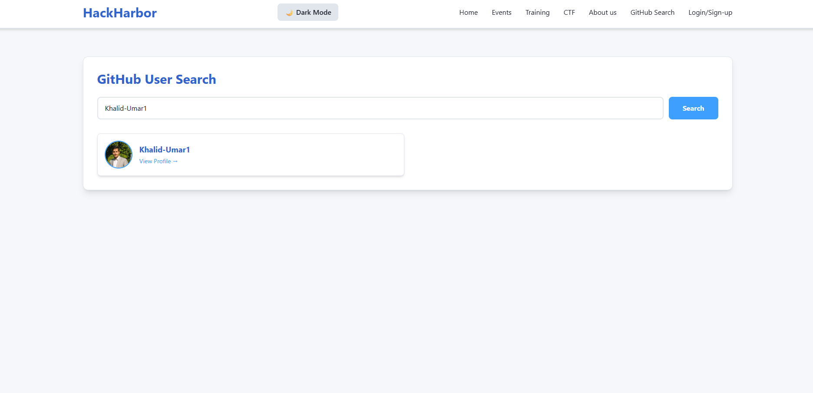
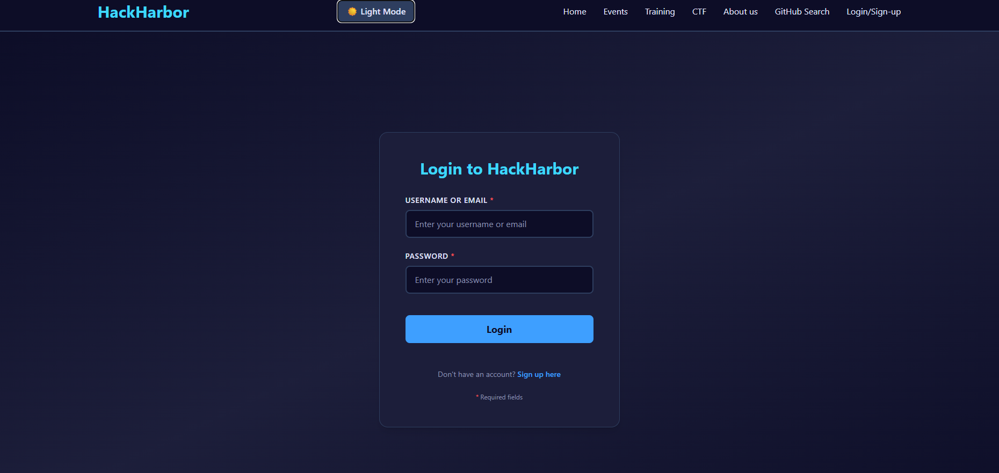
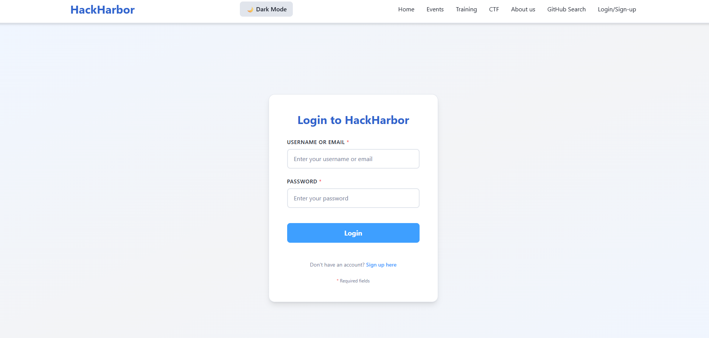

# 🔐 HackHarbor - Cybersecurity Learning Platform

> A modern, interactive cybersecurity education platform built with React, Firebase, and AI integration for hands-on learning and skill development.

---

## 📑 Table of Contents

- [Project Overview](#-project-overview)
- [Team Contribution](#-team-contribution)
- [Features](#-features)
- [Technologies Used](#-technologies-used)
- [API Documentation](#-api-documentation)
- [Screenshots](#-screenshots)

---

## 📖 Project Overview

**HackHarbor** is a comprehensive cybersecurity learning platform designed to provide:
- **Interactive Learning**: Hands-on training modules covering various security topics
- **CTF Challenges**: Capture The Flag competitions to test practical skills
- **AI Assistant**: Intelligent chatbot for cybersecurity Q&A
- **Community Features**: GitHub user search for collaboration
- **Event Management**: Upcoming hackathons, workshops, and competitions

**Course**: Web Programming - Assignment 02  
**Student**: Khalid Umar , Muhammad Talha, Muhammad Ayyan 
**Submission Date**: November 17, 2025  
**GitHub Repository**: [https://github.com/Khalid-Umar1/hackharbor-react](https://github.com/Khalid-Umar1/hackharbor-react)

---

### Team Contribution
## 👥 Team Contributions

### Team Member 1: Khalid Umar ([@Khalid-Umar1](https://github.com/Khalid-Umar1))

**Role**: Frontend Lead & Firebase Integration Specialist

#### Contributions:

**1. Theme Toggle System**
- Implemented dark/light mode toggle in `Header.js`
- Created theme state management in `App.js`
- Configured localStorage for theme persistence
- Applied theme props across all components
- Custom Tailwind color configuration for both themes

**2. Home Page (`src/pages/Home.js`)**
- Hero section with branding and call-to-action
- Features section with dynamic data loading
- YouTube video embed integration
- AI chatbot integration
- LocalStorage demo section

**3. Events Page (`src/pages/Events.js`)**
- Event listing page with dynamic data loading
- Responsive event card layout
- Filter and category system

**4. Related Components**
- `FeatureCard.js` - Feature display component
- `EventCard.js` - Event card with category badges
- `Header.js` - Navigation with theme toggle
- `Footer.js` - Site footer

**5. Data Files (JSON)**
- `public/features.json` - Home page features (3 items)
- `public/events.json` - Events data (4+ events)

**6. GitHub User Search (`src/components/GitHubUserSearch.js`)**
- GitHub API integration
- Real-time user search functionality
- Result display with avatars and profile links
- Error handling and loading states

**7. Firebase Database Integration**
- Firebase project setup and configuration
- Firestore database initialization (`src/services/firebase.js`)
- Environment variables configuration (`.env`)
- Connection testing and debugging

---

### Muhammad Ayyan

**Role**: Content Pages Developer

#### Contributions:

**1. About Us Page (`src/pages/AboutUs.js`)**
- Mission statement section
- Core values grid display
- Team members showcase
- Dynamic data loading from JSON

**2. Training Page (`src/pages/Training.js`)**
- Training modules listing
- Difficulty level categorization
- Duration and level badges
- Responsive 2-column grid layout

**3. Related Components**
- `TeamMember.js` - Team profile card component
- `ValueCard.js` - Core values display card
- `TrainingModule.js` - Training card with difficulty badges

**4. Data Files (JSON)**
- `public/team.json` - Team members data (3+ members)
- `public/values.json` - Core values (4 values)
- `public/training.json` - Training modules (6+ modules)

**5. Styling & Layout**
- Responsive design for About and Training pages
- Theme integration (dark/light mode support)
- Hover effects and animations

---

### Muhammad Talha

**Role**: Interactive Features Developer

#### Contributions:

**1. CTF Page (`src/pages/CTF.js`)**
- CTF challenges grid layout
- Difficulty-based color coding
- Points system display
- Dynamic challenge loading

**2. Login Page (`src/pages/Login.js`)**
- Login/signup form with validation
- Firebase Firestore integration for login data
- Form error handling (username min 3 chars, password min 6 chars)
- Success/error message display
- LocalStorage for last login info
- Real-time form validation

**3. Related Components**
- `CTFChallenge.js` - CTF challenge card component
- Login form validation logic
- Firebase connection for login submissions

**4. Data Files (JSON)**
- `public/ctf.json` - CTF challenges data (9+ challenges)

**6. LocalStorage Features**
- Last login username caching
- Last login timestamp storage
- Auto-load on page refresh

## 🚀 Features

### 🎯 Core Features

#### 1. **Multi-Page Application**
- **Home**: Hero section, features, video, AI chat
- **Events**: Upcoming cybersecurity competitions and workshops
- **Training**: Hands-on learning modules (Beginner to Advanced)
- **CTF**: Capture The Flag challenges with difficulty levels
- **About Us**: Team members, mission, core values
- **Login/Sign-up**: User authentication with Firebase
- **GitHub Search**: Find and connect with developers

#### 2. **Theme Toggle (Dark/Light Mode)**
- Smooth transitions between themes
- Preference saved to localStorage
- Persists across browser sessions
- Affects all pages and components

#### 3. **AI Cybersecurity Assistant**
- Comprehensive knowledge base
- Covers: SQL Injection, XSS, Penetration Testing, Encryption, Firewalls, Phishing, Malware, DDoS, MITM
- Real-world examples and prevention methods
- Instant, detailed responses

#### 4. **GitHub User Search**
- Real-time search using GitHub REST API
- Displays user avatar, username, and profile link
- Responsive grid layout
- Error handling for invalid searches

#### 5. **Firebase Integration**
- Login data stored in Firestore
- Username and password validation
- Timestamp tracking
- Real-time error handling

#### 6. **Local Storage Persistence**
- Theme preference saved
- Last login username and time cached
- Auto-load on page refresh

#### 7. **Responsive Design**
- Mobile-first approach
- Works on all screen sizes
- Tailwind CSS breakpoints (sm, md, lg, xl)
- Hamburger menu for mobile

---

## 🛠️ Technologies Used

### Frontend
- **React 18.3.1** - UI library
- **React Router v6** - Client-side routing
- **Tailwind CSS 3.4.17** - Utility-first CSS framework
- **JavaScript ES6+** - Modern JavaScript features

### Backend & Services
- **Firebase 11.0.2**
  - Firestore Database - NoSQL cloud database
  - Firebase Hosting - Deployment platform
- **GitHub REST API v3** - User search functionality
- **AI Knowledge Base** - Custom cybersecurity expert system

### Development Tools
- **Create React App** - Build toolchain
- **npm** - Package manager
- **Git & GitHub** - Version control
- **VS Code** - Code editor

---

### API Documentation
- Create a .env file in the project's root directory.
- Add your Firebase credentials from the previous step.
-# .env
-REACT_APP_FIREBASE_API_KEY=your_firebase_api_key_here
-REACT_APP_FIREBASE_AUTH_DOMAIN=your-project.firebaseapp.com
-REACT_APP_FIREBASE_PROJECT_ID=your-project-id
-REACT_APP_FIREBASE_STORAGE_BUCKET=your-project.appspot.com
-REACT_APP_FIREBASE_MESSAGING_SENDER_ID=your_sender_id
-REACT_APP_FIREBASE_APP_ID=your_app_id

---
### Screen Shots
- **Home**

- **Events**

- **Training**

- **CTF**

- **About Us**

- **GitHub Search**

- **Login/SignUp**

